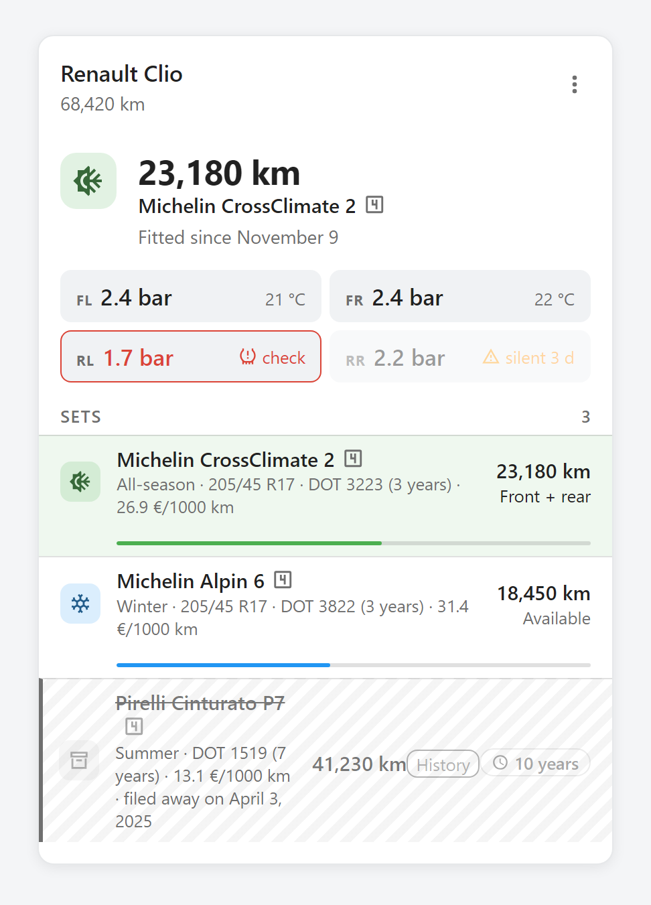
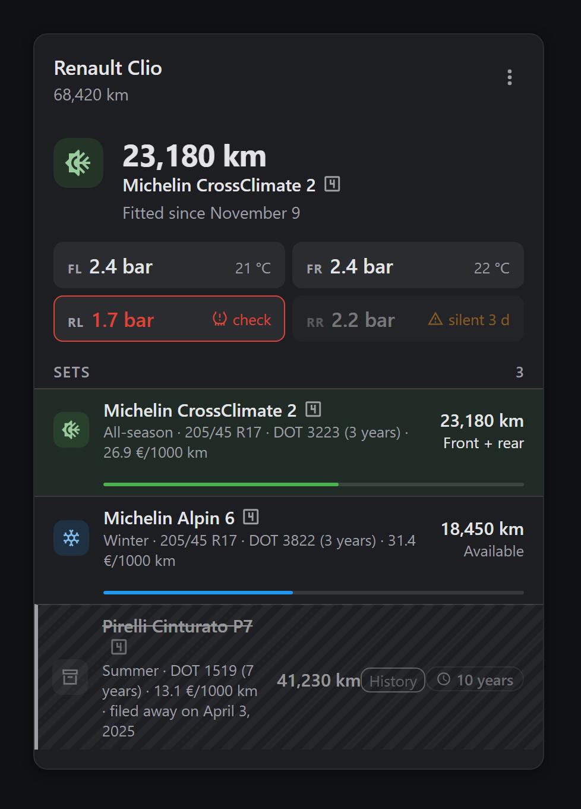
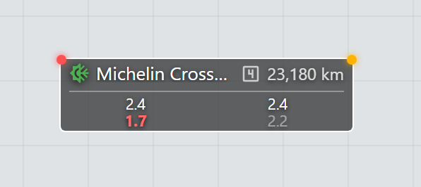

# Tyre Tracker

Mileage per tyre set, per vehicle, for Home Assistant.

Where [snowtire](https://github.com/Limych/ha-snowtire) answers "is it time to
swap?", Tyre Tracker answers "how far has this set run?". One config entry per
vehicle, one device per set: two cars never share a total, and a set keeps its
mileage when you correct its reference or its label.

English and French interfaces. **Entity ids are always English**, whatever the
interface language — so an example, a blueprint or a bug report means the same
thing everywhere.

<p>
  
  
</p>

## Installation

### HACS (recommended)

1. HACS → ⋮ → **Custom repositories** → `https://github.com/Pulpyyyy/ha-tyre-tracker`, category **Integration**.
2. Install **Tyre Tracker**, then restart Home Assistant.
3. **Settings → Devices & services → Add integration → Tyre Tracker**.

### Manual

Copy `custom_components/tyre_tracker/` into the `custom_components/` folder of
your configuration, then restart.

## Entities

A vehicle names its own entities, and so does each set. The last word is fixed
in English; only what is displayed follows the interface language.

| Entity | Example |
|---|---|
| The fitted set, and everything a card reads | `sensor.alfa_gt_tyres` |
| Odometer, when no odometer entity is linked | `number.alfa_gt_odometer` |
| What sits on each axle | `select.alfa_gt_front_set`, `select.alfa_gt_rear_set` |
| One set's mileage | `sensor.continental_mileage` |
| That set's total, correctable by hand | `number.continental_total` |

Home Assistant normally builds an entity id from the *translated* name, in
whatever language the server runs — the same integration would answer to
`sensor.alfa_gt_pneumatiques` in Paris and `sensor.alfa_gt_reifen` in Berlin.
Tyre Tracker pins them instead. An entity you rename by hand keeps the name you
gave it.

## Vehicles and sets

A vehicle is a config entry; its tyre sets live in that entry's options, and
each gets a device of its own, attached to the car. Sets are managed from both
sides — from the card, where you are already looking at the fleet, or from the
configuration. It is the same form: the card drives the integration's own flow
rather than redefining its fields.

A car carries **one set of four, or two pairs** — never a mix. A set of four
therefore takes both axles even if only one is asked for, and fitting a pair
takes off the whole set of four that was there: half a set of four is not a set
of four. The rule holds at data entry too — promoting a fitted pair to "4
wheels" while the other axle carries something else is refused, because the car
would then declare six tyres.

**From the card**

- **Add a set**: the button under the list. As many sets as you like, fitted or
  in the garage — a set does not need to be on the car to exist.
- **Edit the record**: in an expanded set's band. Opens the integration's menu:
  fit, edit, duplicate, move to history.
- **Delete**: in the same place, behind a confirmation. The record, its sensor
  and its device go; the mileage itself is kept and comes back if the set is
  added again. To keep the set visible with its total frozen, prefer *Move to
  history*.

**From Settings → Devices & services → Tyre Tracker**

- **Another vehicle**: the add-entry button at the bottom of that page. Each
  gets its own device, entities and storage. Two vehicles cannot share a name.
- **A set**: **Configure** on the vehicle's row, then *Add a tyre set*.
- **Fit a set**: in that menu, *Fit to the car*. Fitting also happens through
  the two `select` entities and from the card — all three go through the same
  code.
- **Rename the car**: same menu, *Vehicle name*. That name carries the device
  and, through it, the display name of every entity. Entity ids do not move.

Mileage is attached to the set's id and not to its reference: correcting a
mistyped reference does not cost a kilometre.

**The DOT code**, optional, completes a set's record: the four digits of week
and year read on the sidewall — `3223` for week 32 of 2023. The whole DOT line
can be pasted as it reads; only the last four digits are kept. Filled in, the
card shows the set's age beside its reference: a tyre ages standing still, and
no odometer sees it happen. The integration draws no deadline from it — it says
what is written, not when to replace.

## The card

It ships with the integration: nothing else to install, nothing to copy into
`www/`. At startup the integration serves the file at
`/tyre_tracker_frontend/tyres-card.js` and registers it in the Lovelace
resources (storage mode). In YAML mode, add the resource by hand:

```yaml
lovelace:
  resources:
    - url: /tyre_tracker_frontend/tyres-card.js?v=1.0.0
      type: module
```

The file defines two elements, both editable from the interface:

```yaml
type: custom:tyres-card
entity: sensor.alfa_gt_tyres
title: Tyres              # optional, "" for no title
advice_entity: binary_sensor.snowtire   # optional, rotation advice
```

```yaml
type: custom:floor-tyres-badge     # inside a picture-elements
entity: sensor.alfa_gt_tyres
advice_entity: binary_sensor.snowtire   # optional
pressures: true                         # optional, 2x2 TPMS grid underneath
style: { top: 40%, left: 62% }
```



The screenshots above come from [docs/screenshot-harness.html](docs/screenshot-harness.html),
which renders both elements against a stubbed Home Assistant — open it in a
browser to try the card without an installation, or to regenerate the images.

The card follows the language each person picked for themselves, not the
server's: two people looking at the same dashboard read it each in their own.

## Services

`tyre_tracker.mount`, `unmount`, `rotate`, `set_odometer`, `adjust`, `retire`,
`restore` — all targeted at the vehicle's entity, never at the domain, so a
swap on one car cannot move another's counters.

A service that cannot do what it was asked says so: an unknown set, a set in
the history, a pair asked to rotate, an odometer going backwards all raise a
`ServiceValidationError`, which appears in the calling automation's trace
rather than in a log line nobody reads.

## Events

One per thing that happens to a set, so an automation can be written against a
trigger rather than a template watching an attribute:
`tyre_tracker_mounted`, `_unmounted`, `_rotated`, `_retired`, `_restored`,
`_adjusted`, `_separated`. Each payload carries `entry_id`, `vehicle`,
`odometer`, `set_id`, `tyre_set`, `reference`, `season` and `km`.

## Pressure sensors

One pressure sensor per tyre, attached to the set rather than to the car: the
sensor is screwed to the wheel and travels with it. Temperature and battery are
read from the same device — no need to name them. A rotation moves each sensor
with its wheel.

A cell that dies rarely goes unavailable: the entity keeps its last value for
ever. A sensor that has said nothing for 24 hours is shown as silent, whatever
it still reads.

### Pressure alarm

Two ways a tyre gets called wrong, folded into one flag — either is enough:

- **The TPMS's own verdict.** A dock that publishes a `problem` binary sensor
  beside each pressure is picked up from the same device, not asked for —
  exactly like the temperature.
- **A target pressure per axle.** Two optional fields in the set's record,
  next to its size: the door-sticker figures, cold, in bar. Filled in, any
  pressure sensor becomes an alarm — 15 % under or 30 % over the target flags
  the corner, whatever unit the sensor itself reports in. The band is
  asymmetric on purpose: air is only ever lost, and driving alone warms a
  tyre by 10–15 %. A pair is judged by the axle it is fitted to; off the car
  it is judged by its own TPMS alone.

The alarm surfaces in three places: the corner turns red in the card's
pressure grid, the floorplan badge grows a red dot at its other corner (the
amber one is the rotation advice), and the vehicle sensor carries a
`pressure_alarm` attribute listing the corners in alarm — `['front_left']` —
for an automation to trigger on without parsing `pressures`.

A threshold alarm and a silent sensor are different flags and stay different:
a tyre at 1.4 bar needs air, a tyre whose cell died needs a sensor.

## Translating

Three files, all under `custom_components/tyre_tracker/`:

- `translations/<lang>.json` — everything Home Assistant displays: the config
  flow, entity names, service descriptions, error messages. Copy `en.json`
  and translate.
- `words/<lang>.json` — the words the integration composes itself (device
  models, sensor states, the line each flow step opens with). Kept apart from
  `translations/` because hassfest validates those against a fixed schema.
- `frontend/tyres-card.js` — the card's own `WORDS` dictionary, near the top.
  Add a language key beside `en` and `fr`.

English is the fallback, key by key: an unfinished translation shows an English
word inside a translated sentence, which is visible and fixable, rather than a
raw key, which is not.
