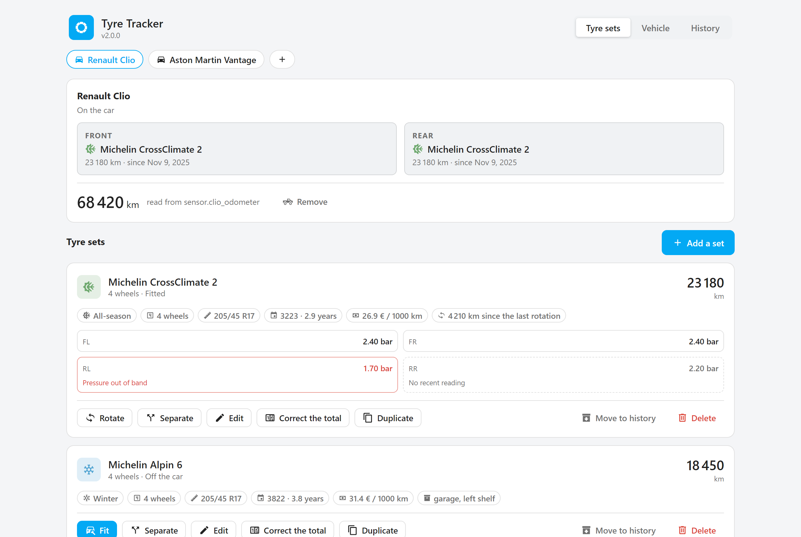
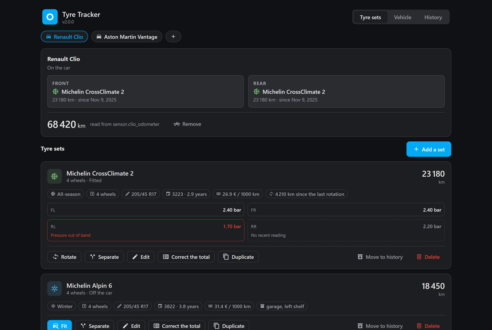
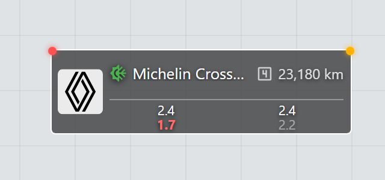
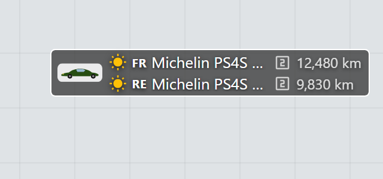

# Tyre Tracker

Mileage per tyre set, per vehicle, for Home Assistant.

Where [snowtire](https://github.com/Limych/ha-snowtire) answers "is it time to
swap?", Tyre Tracker answers "how far has this set run?". One device per
vehicle, one device per set, one mileage store per car: two cars never share a
total, and a set keeps its mileage when you correct its reference or its
label.

Everything is managed from an **admin panel** built into Home Assistant's
sidebar, and displayed by a **Lovelace card** and a **floorplan badge** that
ship with the integration — nothing to copy, nothing else to install.

English and French interfaces. **Entity ids are always English**, whatever the
interface language — so an example, a blueprint or a bug report means the same
thing everywhere.

<p>
  
  
</p>

## Installation

### HACS (recommended)

1. HACS → ⋮ → **Custom repositories** → `https://github.com/Pulpyyyy/ha-tyre-tracker`, category **Integration**.
2. Install **Tyre Tracker**, then restart Home Assistant.
3. **Settings → Devices & services → Add integration → Tyre Tracker** — name
   the first vehicle, and carry on in the editor.

### Manual

Copy `custom_components/tyre_tracker/` into the `custom_components/` folder of
your configuration, then restart.

## The editor

The admin panel at `/tyre-tracker` is where everything is configured: the
config flow declares a vehicle and stops there, and every step of the former
options flow lives here instead — one page that shows the whole car at a
time, where a flow could only offer one form after another.

<p>
  
  
</p>

Four ways in, all reaching the same page: the **sidebar** entry (admins only —
and each user can show or hide it from Home Assistant's own sidebar editor,
long-press the sidebar header), the **Open the editor** button on the
integration page, the **Visit** link on a vehicle's device page, and the
address `/tyre-tracker` directly.

One vehicle at a time, three tabs:

- **Tyre sets** — the car plan with what is fitted where, the odometer, and
  one block per set: its record as chips, its pressure readings, and every
  manoeuvre it can undergo — fit, rotate, separate into pairs, replace, retire,
  restore, correct the total — on the set itself, because that is where you are
  looking when you decide to do it.
- **Vehicle** — its name, its odometer source, its rotation reminder.
  Switching to a source that reads below the tracking opens the resync
  question instead of failing: both figures are real, and only the owner can
  say which one the tracking continues on.
- **History** — the last manoeuvres as the integration recorded them: enough
  to explain a suspicious total, which is exactly what one comes here for.

More vehicles are added from the panel's **+** chip — the integration is a
single entry, and the editor is the one place a car is declared in. The
button on the integration page reads **Open the editor** and does exactly
that: it answers with a link to the panel, never with a second entry.
Deleting a vehicle removes its device, its entities and its `.storage` file;
deleting the integration removes the lot, panel included.

Two safety nets worth knowing about: every write is validated in Python by the
same rules the old flow applied — the panel hard-codes no bound and no default,
both come down with the configuration — and a save built on a set list that
changed meanwhile (a rotation from the card, a second browser) is refused and
the page re-read, rather than silently undoing what happened elsewhere.

## Entities

A vehicle names its own entities, and so does each set. The last word is fixed
in English; only what is displayed follows the interface language.

| Entity | Example |
|---|---|
| The fitted set, and everything a card reads | `sensor.renault_clio_tyres` |
| Odometer, when no odometer entity is linked | `number.renault_clio_odometer` |
| What sits on each axle | `select.renault_clio_front_set`, `select.renault_clio_rear_set` |
| One set's mileage | `sensor.michelin_crossclimate_2_mileage` |
| That set's total, correctable by hand | `number.michelin_crossclimate_2_total` |

Home Assistant normally builds an entity id from the *translated* name, in
whatever language the server runs — the same integration would answer to
`sensor.clio_pneumatiques` in Paris and `sensor.clio_reifen` in Berlin.
Tyre Tracker pins them instead. An entity you rename by hand keeps the name you
gave it.

## Vehicles and sets

The integration keeps a single config entry; every vehicle is a record in it,
with a device of its own, and each tyre set gets another, attached to the car.
Mileage is attached to the set's id and not to its reference: correcting a
mistyped reference does not cost a kilometre.

A car carries **one set of four, or two pairs** — never a mix. A set of four
therefore takes both axles even if only one is asked for, and fitting a pair
takes off the whole set of four that was there: half a set of four is not a set
of four. The rule holds at data entry too — promoting a fitted pair to "4
wheels" while the other axle carries something else is refused, because the car
would then declare six tyres.

A set's record carries what is written on the sidewall — reference, type,
size, DOT date code — and the refinements: a label to tell two identical sets
apart, the price paid (divided by what it runs, it says which reference was
actually the cheapest), where the set waits when it is off the car, and the
target pressures the alarm measures against.

**The DOT code**, optional, completes a set's record: the four digits of week
and year read on the sidewall — `3223` for week 32 of 2023. The whole DOT line
can be pasted as it reads; only the last four digits are kept. Filled in, the
card shows the set's age beside its reference: a tyre ages standing still, and
no odometer sees it happen. The integration draws no deadline from it — it says
what is written, not when to replace.

## The card

It ships with the integration: nothing else to install, nothing to copy into
`www/`. At startup the integration serves the file at
`/tyre_tracker_frontend/tyres-card.js` and registers it in the Lovelace
resources (storage mode). In YAML mode, add the resource by hand:

```yaml
lovelace:
  resources:
    - url: /tyre_tracker_frontend/tyres-card.js?v=2.0.0
      type: module
```

The file defines two elements, both editable from the interface:

```yaml
type: custom:tyres-card
entity: sensor.renault_clio_tyres
title: Tyres              # optional, "" for no title
advice_entity: binary_sensor.snowtire   # optional, rotation advice
```

```yaml
type: custom:floor-tyres-badge     # inside a picture-elements
entity: sensor.renault_clio_tyres
advice_entity: binary_sensor.snowtire   # optional
pressures: true                         # optional, 2x2 TPMS grid underneath
image: /local/cars/clio.png             # optional, car photo or brand logo
style: { top: 40%, left: 62% }
```

The manoeuvres — fitting, an odometer reading — are done from the card through
the integration's own services; describing or correcting a set opens the
editor, on the right car and the right set. The card follows the language each
person picked for themselves, not the server's: two people looking at the same
dashboard read it each in their own.

### The badge and its image


`image` takes any URL — a file under `config/www/` served as `/local/…`, or a
brand logo straight from [home-assistant/brands](https://brands.home-assistant.io)
when the car's integration has one, e.g.
`https://brands.home-assistant.io/renault/icon.png`. With an image the badge
keeps a steady footprint: the set zone is always two lines tall and a lone
set rides centred in it, so the chip is the same size with one set or two —
a badge pinned on a plan should not breathe with its content. The image fits
the height that results, never sizes it. A URL that stops answering removes
the image rather than plant a broken-image glyph on the plan.

<p>
  
  
</p>

## Services

`tyre_tracker.mount`, `unmount`, `rotate`, `set_odometer`, `adjust`, `retire`,
`restore` — all targeted at the vehicle's entity, never at the domain, so a
swap on one car cannot move another's counters.

A service that cannot do what it was asked says so: an unknown set, a set in
the history, a pair asked to rotate, an odometer going backwards all raise a
`ServiceValidationError`, which appears in the calling automation's trace
rather than in a log line nobody reads.

## Events

One per thing that happens to a set, so an automation can be written against a
trigger rather than a template watching an attribute:
`tyre_tracker_mounted`, `_unmounted`, `_rotated`, `_retired`, `_restored`,
`_adjusted`, `_separated`. Each payload carries `entry_id` (the vehicle's
stable id), `vehicle`, `odometer`, `set_id`, `tyre_set`, `reference`,
`season` and `km`.

## Pressure sensors

One pressure sensor per tyre, attached to the set rather than to the car: the
sensor is screwed to the wheel and travels with it. Temperature and battery are
read from the same device — no need to name them. A rotation moves each sensor
with its wheel.

A cell that dies rarely goes unavailable: the entity keeps its last value for
ever. A sensor that has said nothing for 24 hours is shown as silent, whatever
it still reads.

### Pressure alarm

Two ways a tyre gets called wrong, folded into one flag — either is enough:

- **The TPMS's own verdict.** A dock that publishes a `problem` binary sensor
  beside each pressure is picked up from the same device, not asked for —
  exactly like the temperature.
- **A target pressure per axle.** Two optional fields in the set's record,
  next to its size: the door-sticker figures, cold, in bar. Filled in, any
  pressure sensor becomes an alarm — 15 % under or 30 % over the target flags
  the corner, whatever unit the sensor itself reports in. The band is
  asymmetric on purpose: air is only ever lost, and driving alone warms a
  tyre by 10–15 %. A pair is judged by the axle it is fitted to; off the car
  it is judged by its own TPMS alone.

The alarm surfaces in the editor and in three places on the dashboards: the
corner turns red in the card's pressure grid, the floorplan badge grows a red
dot at its other corner (the amber one is the rotation advice), and the
vehicle sensor carries a `pressure_alarm` attribute listing the corners in
alarm — `['front_left']` — for an automation to trigger on without parsing
`pressures`.

A threshold alarm and a silent sensor are different flags and stay different:
a tyre at 1.4 bar needs air, a tyre whose cell died needs a sensor.

## Translating

Four dictionaries, all under `custom_components/tyre_tracker/`:

- `translations/<lang>.json` — what Home Assistant itself displays: the
  config flow, entity names, service descriptions, error messages. Copy
  `en.json` and translate.
- `words/<lang>.json` — the words the integration composes itself (device
  models, sensor states). Kept apart from `translations/` because hassfest
  validates those against a fixed schema.
- `frontend/tyres-card.js` — the card's own `WORDS` dictionary, near the top.
  Add a language key beside `en` and `fr`.
- `frontend/tyre-tracker-admin.js` — the editor's `WORDS` dictionary, same
  shape, same place.

English is the fallback, key by key: an unfinished translation shows an English
word inside a translated sentence, which is visible and fixable, rather than a
raw key, which is not.
